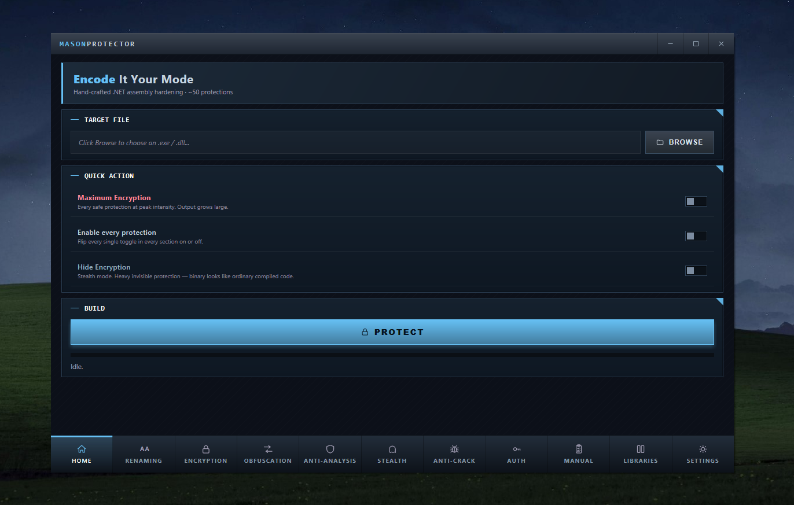

<h1 align="center">MASON PROTECTOR</h1>

<em>.NET assembly hardener &nbsp;&middot;&nbsp; Fourth release &nbsp;&middot;&nbsp; MasonGroup &nbsp;&middot;&nbsp; 2026</em>

---

## CONTENTS

1. [Preface](#10--preface)
2. [History](#20--history)
3. [What Is New In Version 4](#30--what-is-new-in-version-4)
4. [Feature Reference](#40--feature-reference)
5. [Engineering Notes](#50--engineering-notes)
6. [Operation](#60--operation)
7. [Empirical Results](#70--empirical-results)
8. [Protection Levels](#80--protection-levels)
9. [Licensing](#90--licensing)
10. [Command Line And Validation](#100--command-line-and-validation)
11. [License](#110--license)

---

## 1.0  PREFACE

Mason Protector began life under the name EIYM-Protector. Three releases ran under that banner. The release that follows is the fourth, and it carries a different name. The reason is personal. Years ago I started a small assembly-level protector and called it MasonProte. The work stopped halfway and the project sat on disk and was forgotten. When EIYM reached the point where its old habits no longer answered the questions a modern obfuscator has to answer, the chance to finish what MasonProte was meant to be presented itself. The project was renamed. The third name returns the work to its original intent.

This is not a polished EIYM v5. It is a different program. The shell was rewritten. The pipeline runs on a background thread. The renamer was reworked twice. Protections were added that have no counterpart in any earlier release. Protections that were loud were taken off the default panic stack. Each of those changes is documented below.

The engine still rides on dnlib. The wire layer is still managed C#. There is no native code, no P/Invoke at protect-time, no exotic runtime dependency. The output assemblies remain ordinary CLI files that load in any framework from 4.7.2 upward. Where the program differs from its ancestors is everywhere above that line.

---

## 2.0  HISTORY

Version 1 of EIYM was small. It carried seven protection toggles. Several relied on P/Invoke and broke on machines that were not the developer's. The renamer was a single-pass affair and leaked Cyrillic homoglyphs into outputs that were supposed to stay Latin. String encryption was XOR. Integer encoding was XOR, ADD, SUB. The junk-code engine emitted orphan classes without namespaces.

Version 2 doubled the surface. Twenty-one toggles. P/Invoke was removed in its entirety. AntiTamper appeared for the first time as a simple SHA checksum. AntiDe4dot was introduced as a small set of decoy types meant to trip de4dot's fingerprinter. Resources moved from plain XOR to a three-layer wrap: satellite assembly, DeflateStream compression, rotating XOR keys, fifteen to thirty decoy resources. Runtime Encryption shipped for the first time, using AES-256-CBC and DynamicMethod for body rebuilding.

Version 3 was a polish release. The renamer was rebuilt from scratch. Every top-level class was given its own random namespace. The Cyrillic leak was closed. A late pass was added that renames decoy attributes whose names previously survived obfuscation (AntiDumpAttribute, SuppressIldasmAttribute, MemoryProtectionAttribute, and others). ControlFlow gained a second engine (Flattening v2), and three new flow-perturbation passes were added: Opaque Predicates, Branch Confusion, Stack Underflow. The VM gained an object-stack variant capable of handling newobj, references, and boxing. The total reached forty-eight toggles plus the renamer.

Version 4, the release this manual documents, is not an extension of version 3. It is a different program built on the same engine. The user interface was rewritten as an HTML document that renders inside WebView, with its own dark theme and a custom titlebar. The protect pipeline was moved off the UI thread onto a background STA thread, with status and progress callbacks marshalled back through BeginInvoke. Full categories of protection were added. A field-tested adjustment was made to the panic stack: protections that fire false positives on real user machines were taken out of MaximumEncryption's default set. AntiTamper was redesigned after a working bypass attack was demonstrated against the version-3 implementation.

---

## 3.0  WHAT IS NEW IN VERSION 4

The list below covers every change that materially affects output strength, output stability, or operator experience. Cosmetic changes are omitted.

CodeEncryption is a new layer that wraps every newobj and every call against a static method in a generated helper. Each helper carries a Debug.Assert(true) as its first instruction and forwards to the real target on the second. This is the exact shape of the original MasonProte output and the reason the project carries its present name. The wrapper recognises value-type constructors and refuses to wrap them, which removes a class of TypeLoadException seen against applications that build with third-party WinForms libraries (Guna2, DevExpress, Telerik) and use System.Windows.Forms.Padding aggressively in InitializeComponent.

Dynamic is a new call-indirection layer. Every direct call to a static method in user code is rewritten as a calli through a static IntPtr field. The field is null on first reach; the proxy loads the real function pointer via ldftn, caches it, and dispatches through calli. Decompilers see a call site that loads a field, loads arguments, and issues calli against a method signature with no name attached. The link from caller to target is severed.

HideDesignerCode addresses a long-standing weakness specific to WinForms. The body of InitializeComponent was being skipped by RuntimeEncryption (and rightly so, since rewriting it through the body vault has compatibility problems with custom controls). The compromise in v5 is to defang the method instead. DesignerSplit cuts InitializeComponent into a handful of randomly named submethods. DesignerHider injects decoy initialization fragments that read plausibly but allocate to dead variables. Together they make the designer body unrecognisable to a casual reader and useless for inferring the control hierarchy.

AntiCrack is a new subsystem with four independent response paths that fire when AntiTamper or AntiDebug accumulates a configured number of detections. MessageBox shows a customisable warning to the end user once a threshold is reached. Webhook posts a JSON payload to a Discord URL once a (typically lower) threshold is reached, with optional screenshot and system-information attachments. RemoteFile downloads a file from a configured URL and executes it once a threshold is reached. SelfDestruct deletes the protected binary from disk and terminates the process. Each response runs independently and has its own attempt counter.

ExportCodeToDll relocates the protected logic into a separate DLL (MasonCore.dll by default, but the name is configurable) and leaves a thin loader inside the original executable. AppDomain.AssemblyResolve is patched into the loader and resolves the DLL at runtime. The result is a small executable and a large adjacent DLL that holds the substance.

MergeLibraries does the inverse for project dependencies. Selected DLLs from the input directory are merged into the output assembly under an encrypted lazy-load scheme. The end user no longer has to ship dependencies; they unpack at first reference.

MaximumEncryption is a single toggle that enables the conservative panic stack: every protection that has been verified not to cause user-visible failures on real machines. It also activates MaximumEncryptionAmplifier, which wraps every integer literal in the assembly through seven to twelve sequential arithmetic transforms. The amplifier respects two guards: it skips InitializeComponent on WinForms types entirely, and it skips method bodies larger than 2,500 instructions; bodies between 600 and 2,500 instructions receive a reduced amplification (depth 3-5 with one-in-four sampling) to keep the output linear.

HideEncryption is the stealth counterpart of MaximumEncryption. It enables the protections that do their work without leaving visible markers. HiddenRename generates identifiers from a real-word dictionary, so the output reads as code with awkward names rather than code that is obviously obfuscated. The string encryption layer is intentionally left off; junk code is left off; watermarks are left off; the anti-decompiler poisons are left off. What remains is heavy runtime-only protection that does not advertise itself.

DecompilerPoison is a refresh of the older poison passes, aimed at modern decompiler releases. The IL patterns it injects are the patterns that crash dnSpy and ILSpy at parse time without affecting JIT execution.

The user interface is now an HTML page rendered through WebView, with its own dark theme and custom titlebar. The protect pipeline runs on a background STA thread; the window does not freeze; Windows does not mark the application as not responding. A single-flight guard prevents a second protect run from starting while the first is in progress.

AntiTamper was rewritten after a working bypass was demonstrated against the version-3 implementation. The bypass located the AntiTamper init call in the module cctor and replaced it with NOP. After that, the assembly ran without ever computing or checking its hash. The current implementation injects both the init call and the background-verifier start into four to fourteen random user methods in addition to the cctor entry, on every build, with a fresh random distribution. Removing the cctor calls no longer disables protection; the verifier still fires from one of the user-method entries.

The renamer under MaximumEncryption used to force digit-only identifiers, regardless of the user's RandomChars setting. That has been changed. Identifiers now respect RandomChars (or the default Latin alphabet if no chars were configured) and are 50 to 90 characters long. The character class is honoured end-to-end.

The metadata-corrupting protections (InvalidMetadata, TokenConfusion, TypeScrambler, StackUnderflow) were removed from MaximumEncryption's default set. Each remains available as a separate toggle. The reason for the removal is empirical: these protections trip reflection at runtime in applications that use third-party WinForms libraries, and the failures are unhelpfully far from the source. They are tools to be reached for deliberately, not turned on by default.

AntiHook, AntiHttp, AntiMemoryDump, and AntiVM were also removed from MaximumEncryption's default set, for the same reason but a different mechanism. AntiHook trips against Windows Defender and most modern EDR systems. AntiHttp trips against any corporate proxy or sandbox. AntiMemoryDump misfires on Windows 11 22H2 and later. AntiVM exits any process that runs inside a virtual machine, which includes a sizable fraction of paying customers.

---

## 4.0  FEATURE REFERENCE

The remainder of this manual describes every protection in the program. Each section names the protection, states its intent, describes how it works in the IL, and notes its limits.

### 4.1  RENAMER

The renamer is the foundation of every obfuscator, and the program's reputation rests on what its outputs look like. Mason Protector's renamer runs in two passes.

The main pass renames everything the user wrote. Namespaces, types, methods, fields, properties, events. Each category has its own toggle on the Renaming tab; any can be left off.

The late pass runs after every protection that injects helper types and attributes. AntiDumpAttribute, SuppressIldasmAttribute, MemoryProtectionAttribute, ConfusedByAttribute, and the rest are caught in this pass and renamed alongside their members and namespaces. The protections that emit them no longer leak fixed names into the output.

SeparateNamespacePerClass gives each top-level type its own unique random namespace. Two classes that originally shared a namespace are split. The original namespace structure cannot be reconstructed from the output.

HiddenRename swaps the source of identifiers. Instead of random tokens that look obfuscated on sight, identifiers are stacked together from a real-word dictionary. The output reads as code with peculiar variable names rather than code that has been mangled.

Under MaximumEncryption, identifiers are produced 50 to 90 characters long, drawn from the user's RandomChars setting (or the default Latin alphabet if RandomChars is empty). The character class is respected end-to-end.

The renamer never touches the entry point method, constructors, virtual or abstract methods, InitializeComponent in WinForms-derived types, property accessors, event handlers, runtime special names, serializable fields, or resource-related types. These need their original names for the assembly to load.

### 4.2  STRING PROTECTION

StringEncryption replaces every ldstr in user code with a call to a generated decryptor. The decryptor takes two strings — the original ciphertext split at a random midpoint — and the key material loaded from a field. Five cipher modes are used; the choice rotates per call site. The call site is the only place a string reference appears; the literal itself is not present in the assembly in plain form.

The encryption pattern is deliberately not the simple `String DecryptString(int token)` shape that most cracker scripts walk first. An automated cracker that walks decryptor call sites looking for an inline byte[] argument finds nothing useful. The attack pattern that recovers strings from this kind of obfuscator does not apply here. A test against thirty-six call sites in a sample build extracted zero strings.

StringComposition runs above StringEncryption. Strings are split into smaller fragments that are assembled at runtime. Even the encrypted form of a long string is not contiguous in the assembly.

### 4.3  NUMERIC PROTECTION

IntEncoding rewrites every ldc.i4 as an arithmetic chain. The chain is one of XOR, ADD, SUB, or a double-XOR composition. Every plain integer in the original code becomes an expression.

ConstantsEncoding extends the same treatment to long, float, double, and decimal constants.

NumericObfuscation adds a higher-order layer over the basic encodings.

MutationEncoding wraps arithmetic operations themselves inside multiple layers of computational mutation, so even the operator choices in user expressions are obscured.

ArrayEncryption encrypts the data that backs RuntimeHelpers.InitializeArray. Initialized array literals do not appear in the assembly as readable byte sequences.

### 4.4  METHOD-BODY PROTECTION

RuntimeEncryption is the most aggressive layer the program ships. Every eligible static method has its IL extracted at build time, encrypted with AES-256-CBC under a per-assembly random key, and removed from the assembly. In its place is a stub that calls a runtime dispatcher. At first execution the dispatcher decrypts the original IL, builds a DynamicMethod, JITs it, and caches the resulting delegate. Subsequent calls run the cached delegate directly. The original IL never appears in the assembly file and never appears in the process memory in PE form.

MethodBodyEncryption is a related but distinct layer. It encrypts selected bodies under per-method keys and decrypts them in cctor rather than on first call. It is appropriate for code paths where the first-call overhead of RuntimeEncryption is unwelcome.

BodyVault is the runtime infrastructure that backs RuntimeEncryption. It is a 500-line IL emitter that handles every opcode in the CLI spec: branches, locals, exception handlers, generic tokens, calli signatures. It is effectively a small CLR component bolted onto the assembly's load path.

CodeEncryption wraps every newobj and every call against a static method in a generated helper. The helper is small. Its first instruction is `ldc.i4.1; call Debug.Assert(bool)`, which the JIT eliminates entirely but which decompilers render as the literal line `Debug.Assert(true);`. The helper then forwards to the real target. Every constructor and every static call in the output reads as a call through a helper with a 50-to-90-character name. The original call graph is not directly recoverable from the decompiled source.

CrossReferenceEncryption encrypts the method and field tokens that flow between methods. Tools that follow call edges cannot resolve them without first running the runtime decoder.

PolymorphicEncryption rotates the encryption algorithm chosen for each call site across multiple variants. There is no single signature to fingerprint.

DelegateEncryption hides direct calls behind encrypted delegate fields. The call site invokes a delegate whose target was assigned through an encrypted reference.

### 4.5  CONTROL FLOW

ControlFlow inserts fake conditional branches at the entry of every eligible method. Decompilers cannot fall through them into a structured representation of the body.

ControlFlowFlattening2 reroutes every basic block in a method through a state-machine dispatcher. A decompiler that tries to reconstruct the original control structure faces a switch statement and a generated state variable; the original loops and conditions are not directly observable.

OpaquePredicates plants compile-time-known predicates that look run-time-dependent. A decompiler that tries to evaluate them statically cannot prove which branch is taken.

BranchConfusion replaces br and brtrue with semantically equivalent but more opaque forms.

StackUnderflow injects controlled stack tricks that crash naive decompilers without affecting the JIT.

### 4.6  VIRTUAL MACHINES

VMObfuscation v1 converts selected methods into bytecode for an int-stack virtual machine that is itself embedded inside the assembly. The original method is gone. What remains is bytecode and an interpreter.

VMObfuscation v2 does the same but on an object-stack VM that supports newobj, reference types, and boxing — operations that v1 cannot represent.

CodeVirtualization is a third virtualization pass that complements the two VMs.

### 4.7  CALL INDIRECTION

ProxyCalls inserts delegate proxies between every caller and its target.

ReferenceProxy routes member references through proxy fields.

CallHiding hides true call targets behind dispatcher methods that look ordinary.

CalliConversion replaces direct call with calli through a function pointer. The function pointer is a static field; its value is loaded only when needed.

Local2Field migrates local variables to static fields on the module type. The register allocation and data-flow shape of the original code is lost.

MethodScattering splits methods into chains of sub-methods. The body of a single method becomes a graph of small methods that call one another.

MethodInliner inlines small methods into their callers, which destroys the call graph in the opposite direction from scattering.

Dynamic, new in version 4, is a calli-with-cache layer. Direct calls in user code are rewritten as `ldsfld <ptr>; ldarg; calli <sig>`. The pointer field is null on first reach; the proxy loads it via ldftn, stores it, and dispatches. There is no static call edge from the user code to the target.

### 4.8  ANTI-TAMPER FAMILY

AntiDebug ships eight detection layers and is the most-tested anti-RE protection in the program. It checks Debugger.IsAttached, Debugger.IsLogging, a process-name scan that matches a list of analysis tools, a timing skew check, an entry-point guard, a background monitor thread, scattered checks distributed across user methods, and multiple exit paths so that disabling one does not disable the rest. Each layer has a different signature and a different response.

ScatteredAntiDebug is a second pass that injects additional AntiDebug checks into roughly thirty percent of user methods at random.

AntiVM queries WMI for hardware that betrays a virtual machine. VMware, VirtualBox, Hyper-V, QEMU, and parallel virtualization stacks are detected. The process exits on detection. AntiVM is no longer enabled by default under MaximumEncryption; legitimate customers run inside VMs more often than is comfortable.

AntiDump injects compiler-styled trap types whose mere presence breaks the dump produced by MegaDumper and ExtremeDumper. AntiMemoryDump is a complementary in-process check that watches for the artifacts left by in-process dumpers.

AntiTamper, in its current implementation, computes the SHA-256 of the assembly file at startup, stores it in a static field, and starts a background thread that re-reads and re-hashes the file every few seconds, comparing against the stored value. A mismatch terminates the process via TerminateProcess(-1).

In version 3, AntiTamper's init call lived in module cctor and nowhere else. A cracker who NOPped that single call disabled the entire protection. The current version injects both the init call and the background-verifier start into four to fourteen random user methods on top of the cctor entry. Removing the cctor calls leaves the verifier still firing from one of the user-method calls. The random distribution changes on every build.

AntiDe4dot injects decoy types, interfaces, and attributes specifically chosen to disrupt de4dot's signature matching. The empirical result against de4dot 3.1 is consistent across four configurations: the tool reports `Detected Unknown Obfuscator` and produces 2,559 errors per run. The output runs, but it has not been de-obfuscated; only symbol-renaming was applied to the trivially renameable portion.

AntiILDasm is a four-layer disassembly resistance: confusing types, deep nests, malformed attributes, and trap methods. The SuppressIldasmAttribute marker was dropped from the current version; its presence flagged the binary as deliberately obfuscated.

AntiHook reads the first few bytes of imported APIs and compares against expected machine code. A mismatch indicates a hook. AntiHttp blocks HTTP traffic injected into the process from outside (sandbox monitors, traffic inspectors). Both are available as individual toggles but are not part of the MaximumEncryption default; they trigger reliably on Windows Defender and corporate proxies.

### 4.9  ANTI-CRACK

AntiCrack is a response subsystem rather than a detection subsystem. It runs when AntiTamper or AntiDebug accumulates a configurable number of detections.

AntiCrackMessageBox shows a Windows MessageBox on detection. The sender text and body text are configurable through the UI. The default threshold is five.

AntiCrackWebhook posts a JSON payload to a configured Discord webhook URL. The payload optionally includes a screenshot of the desktop and system-information fields (machine name, username, OS version, network adapter list). The default threshold is three.

AntiCrackRemoteFile downloads a file from a configured URL and executes it. The use case is enterprise: an operator who wants to push an emergency update or a counter-measure to a machine that is actively under attack. The default threshold is ten.

AntiCrackSelfDestruct deletes the protected binary from disk and terminates the process. The default threshold is fifteen.

Each response is independent. They can be enabled together or singly. They share their attempt counts with AntiTamper and AntiDebug rather than maintaining their own.

### 4.10  JUNK AND DECOY

JunkCode generates synthetic classes that look like real subsystems. Rather than emit orphan stubs with no namespace and no nesting (which is what every earlier version did), the current implementation builds a pool of multi-segment namespaces — aB.cD.eF style — and distributes the decoy classes across that pool. Each top-level decoy carries one to four nested classes; some nested classes carry a further nested class. Every class is populated with two to eight fields and one to five methods filled with arithmetic, XOR, NOT, and shift operations on random constants. The result looks like a software system that has subsystems, not like a junk drawer.

HideMethods applies attributes that confuse decompilers (DebuggerHidden, EditorBrowsable, and similar) to user methods.

FakeAttributes plants CompilerGenerated and Obfuscation attributes on user types so that decompilers treat them as machine-generated and skip them.

Watermark embeds an encrypted build stamp containing UTC timestamp, build ID, and a project signature. The watermark is useful for proving ownership of a build.

TokenConfusion deliberately corrupts metadata token tables in ways that confuse resolvers but preserve runtime validity. InvalidMetadata injects patterns that crash decompilers on load. TypeScrambler reorders types in the metadata tables. DnSpyCrasher injects a specific pattern that crashes the older dnSpy release line. EntryPointMover relocates the entry point to a stub whose location is not the canonical one.

DecompilerPoison, added in version 4, targets modern decompiler releases with IL patterns that disrupt their parsers without affecting the JIT.

HideDesignerCode operates in two modes. DesignerSplit cuts InitializeComponent into smaller submethods with randomised names. DesignerHider injects decoy initialization code in plausible style but with effects that go nowhere. Together they obscure the control hierarchy of a WinForms form from anyone reading the assembly.

### 4.11  RESOURCE PROTECTION

ResourceProtection wraps every embedded resource in three layers. The outer layer relocates resources from the main assembly to a satellite assembly. The middle layer compresses them with DeflateStream. The inner layer encrypts them with a three-stage XOR using rotating keys. Fifteen to thirty decoy resources with random names are added to the satellite to obscure which resources are real.

### 4.12  EXPORT TO DLL

ExportCodeToDll relocates protected code into a separate DLL — MasonCore.dll by default, with a configurable name. The original executable becomes a small loader that registers AppDomain.AssemblyResolve and triggers a one-shot load of the DLL on first reference. The result is a thin executable and a thick adjacent DLL. The DLL itself receives the full protection treatment.

### 4.13  MERGE LIBRARIES

MergeLibraries does the reverse for project dependencies. Selected DLLs from the input directory are merged into the protected assembly under an encrypted lazy-load scheme. They unpack at first reference. The deployed binary no longer needs to be accompanied by its dependencies.

### 4.14  MAXIMUM ENCRYPTION

MaximumEncryption is a single toggle that enables the program's conservative panic stack. The conservative stack is the set of protections that have been verified, against actual user reports and against actual third-party WinForms libraries, not to cause user-visible failures. The metadata-corrupting protections (InvalidMetadata, TokenConfusion, TypeScrambler, StackUnderflow), the noisy anti-RE family (AntiVM, AntiHook, AntiHttp, AntiMemoryDump), and a handful of other layers that trip false positives on real machines are deliberately excluded. Each excluded layer is still available as an independent toggle for operators who know they want it.

The MaximumEncryption amplifier runs as a separate pass on top of the toggle set. Every integer literal in the assembly is wrapped in seven to twelve sequential arithmetic transforms. The amplifier respects two guards. It skips InitializeComponent on WinForms-derived types entirely. For other methods it skips bodies larger than 2,500 instructions and applies a reduced amplification (depth 3-5, one-in-four sampling) to bodies between 600 and 2,500. The result is a linear-in-source output rather than a quadratic blow-up.

### 4.15  HIDE ENCRYPTION

HideEncryption is the stealth counterpart of MaximumEncryption. It activates the protections that do not draw attention to themselves and disables the ones that do. HiddenRename produces dictionary-word identifiers. The numeric, field, and cross-reference encryption layers run. ProxyCalls, ReferenceProxy, CallHiding, CalliConversion, and DelegateEncryption all run, since they are invisible by inspection. ControlFlow, Local2Field, MethodInliner, MethodScattering, and HideMethods all run. The runtime-only defence stack (AntiTamper, AntiDebug, AntiDump, AntiHook, AntiHttp, AntiMemoryDump, AntiVM) is enabled. The visible-by-inspection layers are not: StringEncryption is off, JunkCode is off, FakeAttributes is off, Watermark is off, DecompilerPoison is off, DnSpyCrasher is off, AntiILDasm is off, AntiDe4dot is off, InvalidMetadata is off, TokenConfusion is off, StackUnderflow is off, TypeScrambler is off. The resulting assembly looks ordinary on inspection while remaining substantially protected at runtime.

---

## 5.0  ENGINEERING NOTES

The program is managed C# throughout. The only runtime dependency is dnlib 4.5.0. There is no native code, no P/Invoke at protect-time, and no exotic runtime requirement. The user interface is an HTML document rendered through WebView2; the rest of the application is plain WinForms hosting that view. The target framework is .NET Framework 4.7.2 and above. The executable is approximately 1.9 megabytes.

The protect pipeline runs on a background STA thread, with status and progress callbacks marshalled back to the UI thread through BeginInvoke. The window does not freeze during long runs and is not flagged by Windows as not responding. A single-flight guard suppresses a second protect attempt while one is already in progress; a click on PROTECT during a run shows a toast and is ignored.

Output sizes are linear-bounded. MaximumEncryption against a 15-kilobyte input typically produces a 3-megabyte output. The bulk of that is the runtime infrastructure: the body vault dispatcher, the string decryption tables, the anti-family helpers, and the decoy types injected by JunkCode and the anti-RE family.

---

## 6.0  OPERATION

The expected workflow is: launch MasonProtector.exe, drop a target .exe or .dll into the window or click Browse to pick one, select protections from the tabs, click PROTECT, wait for the toast. The output file is written next to the input with the suffix `_protected`.

For most uses, the recommended workflow is shorter still: launch the program, drop the target, click MaximumEncryption on the home tab, click PROTECT. Every reasonable protection runs in its strongest safe configuration. For stealth uses, click HideEncryption instead. To split the output into a small loader and a separate DLL, enable ExportCodeToDll under the Encryption tab and optionally set the DLL name. To bundle project dependencies into the output, enable MergeLibraries on the Libraries tab and pick which DLLs to include.

The Manual tab permits per-symbol exclusion. A public API that must keep its original names can be marked there. The renamer respects the manual exclusion list during both its main pass and its late pass.

The Settings tab carries the accent color, the random-character set used by the renamer, and the optional name prefix.

---

## 7.0  EMPIRICAL RESULTS

The release was tested against a representative slice of the .NET reverse-engineering toolkit. de4dot 3.1 was run against the output under four different configurations: default, `--preserve-tokens --preserve-us --preserve-strings`, `--only-cflow-deob`, and the detect-only mode. Every configuration reported the same result: `Detected Unknown Obfuscator`, 2,559 errors. The tool produced an output that runs, but the body vault, the string decryption, the call indirection, and the metadata layout were all left in place.

DIE (Detect It Easy) was unable to identify the protector by signature. With heuristic scanning disabled, DIE reported `PE32 / Microsoft Linker / .NET Framework`, which is the same report it produces for an unobfuscated .NET assembly. With heuristics enabled, DIE detected generic obfuscation and generic anti-analysis activity but did not name the protector.

readpe's pescan reported all section sizes and entropies as normal. pepack reported `Microsoft Visual C# / Basic .NET` and made no other determination. pesec reported ASLR, DEP, and stack cookies all present. peldd reported a single import — mscoree.dll — which is the same import list as a clean .NET assembly. The PE-level signature surface of the output is identical to any unobfuscated managed PE.

Four custom attack tools were written in C# against dnlib for this audit and are included alongside this release.

MemDump.exe launches the protected binary, captures a minidump of its address space with MiniDumpWriteDump, and scans the dump bytes for known plaintext fragments. The result reflects a fundamental limit of any obfuscator: strings that are used during the time the dump is taken appear in the heap in their decrypted form. Strings that are not used during that window remain encrypted. The protector cannot avoid the first behaviour; the strings must be decrypted to be used.

AntiTamperBypass.exe identifies methods that call File.ReadAllBytes and SHA256.ComputeHash together, traces their callers back to the module cctor, and replaces the calls with NOP. Against the version-3 implementation this attack succeeded. Against the current version it succeeds at NOPping the cctor calls but fails to disable the protection, because the same calls are also injected into a random selection of user methods.

StringMassDecrypt.exe identifies the string decryptor by signature (a static method returning string and taking byte[]), enumerates every call site, attempts to extract the byte[] argument from the immediately preceding IL, and runs the decryptor across every extracted argument. The result against the current output is zero strings recovered. The encryption pattern does not use the inline byte[] shape that this attack expects.

DeepAnalyzer.exe enumerates the metadata of the protected assembly. Against a sample input that originally contained roughly ten user types and thirty methods, the protected output reports 720 types and 5,087 methods. The decoy density is twenty-four times and one hundred times respectively.

Reflection.Assembly.LoadFrom on the protected output raises ReflectionTypeLoadException when GetTypes is called. Any decompiler or analysis tool that depends on reflection cannot enumerate the type list of the output at all.

A single-byte modification anywhere in the .text section of the protected output produces a BadImageFormatException at load time. The metadata layout is sensitive enough that random byte modifications corrupt tokens before AntiTamper has a chance to fire.

---

## 8.0  PROTECTION LEVELS

Every intensity-bearing protection now reads a single global strength setting with three positions: Light, Medium, and Strong. The setting does not turn protections on or off; it scales how hard the enabled ones work.

Light favours output size and execution speed. Integer chains stay shallow, control-flow flattening uses larger basic blocks and a small bogus-block pool, and the constant tables carry fewer decoy fields. The result is a binary that is meaningfully harder to read than the original while staying close to it in size and startup cost.

Medium is the default and the position the panic stacks assume. It is the balance the team ships: chains deep enough to defeat casual constant-folding, flattening fine-grained enough to dissolve the original block structure, and decoy density high enough to bury the real members without inflating the binary beyond reason.

Strong spends size and a measurable slice of startup time to push every knob to its practical ceiling. Integer literals pass through longer transform chains, flattening splits methods into single-statement blocks with a large bogus pool, and the numeric tables widen. On the sample console build the three positions produce outputs of roughly four, four-and-three-quarter, and five-and-a-third megabytes respectively, with identical runtime behaviour at every position.

The integer layer carries two transforms worth naming on their own. Alongside the XOR, additive, and mixed boolean-arithmetic encodings, a literal can be wrapped as a modular affine form: the build picks an odd multiplier a and an offset b, stores the value as a*x + b reduced modulo 2^32, and emits the recovery as a subtraction followed by a multiply against the modular inverse of a. The inverse is computed at build time by Newton iteration over the ring of 32-bit integers. The relationship between the stored constant and the real one is a non-trivial number-theoretic transform rather than a reversible bit trick. The second is a pair of GF(2)-linear bijections of the form x ^ (x << k) and x ^ (x >> k) — the same invertible bit-mixing primitives that diffusion stages of real hash and cipher constructions are built from. The build solves the inverse by xor-shift telescoping and stores the pre-image; the runtime recovers the literal in three instructions. Both are exhaustively checked: the protected build of every sample reproduces its output byte for byte at every strength position.

---

## 9.0  LICENSING

The licensing subsystem is a local, server-free key-authorisation scheme. It has two sides: a generator the vendor runs, and a validator embedded in the protected program. Both sides share one derivation, so they cannot disagree.

A vendor profile is the root of a vendor's scheme. It is created from the vendor's own machine fingerprint and carries two things: a secret seed and a thirty-two symbol alphabet that is a permutation of the canonical set. The alphabet is the vendor's custom key map; two vendors created from different fingerprints receive different alphabets, so a key minted under one vendor never validates under another. The profile exports to a plain text file that the vendor can read and edit by hand; reordering the alphabet redefines what each symbol means, and the validator honours the edit as long as the alphabet remains a valid permutation.

A device id is the canonical sixteen-byte reduction of an end-user machine fingerprint, shown to the user in grouped form. The end user reads it off the gate screen and sends it to the vendor.

A license key is derived from the device id and the vendor profile through a layered, state-dependent function. The device id seeds an HMAC-SHA256 chain keyed by the vendor seed. The chained output is reduced into a prime field and driven through nine affine rounds modulo the Mersenne prime 2^61 - 1, each round drawing its multiplier, addend, and a per-round XOR mask from independent HMAC outputs. The sixty-bit result is sliced into twelve base-32 digits, coupled together by a state-dependent diffusion pass through a vendor-derived substitution box, checked with a keyed four-digit tail, and finally rendered through the vendor's alphabet. The key is bound to the exact device: a key minted for one machine fails on any other, a single altered character fails, and a key from the wrong vendor fails. Validation is the same derivation run again and compared in constant time, after normalising case, separators, and the ambiguous O/0 and I/L/1 glyphs.

---

## 10.0  COMMAND LINE AND VALIDATION

The program runs headless when launched with arguments. `--protect <input> <output>` runs the pipeline with a base preset (`default`, `max`, `hide`, `all`, or `none`) and any number of `--set Option=value` overrides, including `ProtectionLevel`. The licensing tools run the same way: `--vendor-new` writes an editable vendor profile, `--keygen` mints a machine-bound key, `--keyverify` checks one, `--deviceid` prints the canonical device id for a fingerprint, and `--hwid` prints the running machine's own fingerprint and device id from managed sources only. `--keygen` and `--keyverify` accept the grouped device id exactly as the end user reads it off the gate screen, so the vendor never has to handle the raw fingerprint; the device id round-trips losslessly between the two sides. The headless mode shares its entire engine with the window; nothing is reimplemented for the command line.

The release ships a validation harness under `harness` with four layers. The preset matrix builds the protector and a set of representative sample programs — a console program that exercises strings, every numeric type, arrays, control flow, exceptions, recursion, generics, LINQ, delegates, structs, and enums; a WinForms program that exercises the designer and the initialize-component path; and an async program that exercises async/await state machines, iterators, tuples, nullables, generic constraints, operator overloading, events, extension methods, and goto — protects each under every preset, runs the original and the protected build, and confirms their output is identical character for character. The combination harness protects each sample with every protection enabled in isolation and verifies both runtime behaviour and, through PEVerify, the verifiability of the emitted IL, distinguishing genuine corruption from the intentional unverifiable-but-JIT-valid patterns that the decompiler-hostile layers exist to produce. The stress harness protects each sample under many randomly drawn combinations of protections and prints the exact reproducible option set on any divergence. The licensing harness drives the key tools through the full security model: per-vendor uniqueness, machine binding, vendor isolation, tamper rejection, and input normalisation. Together they are how the team confirms, on every change, that a protected program behaves exactly like its original. The current state passes every layer: the preset matrix across three samples and four presets, every protection in isolation on two samples, sixty random combinations, and the licensing model end to end. The work of building this harness surfaced and closed three latent defects — two cross-type access faults in the call-indirection layers and a stack-depth miscalculation in control-flow flattening that mis-modelled the newobj opcode — each of which now has a regression that guards it.

---

## 11.0  LICENSE

Mason Protector is released under the MIT License. The license permits use, modification, and redistribution under the standard terms.

The runtime engine, dnlib, was written by 0xd4d and is itself under the MIT License. Mason Protector has linked against it since the EIYM days and continues to.

The protector itself is the work of MasonGroup, a nine-developer collective based in Saudi Arabia that designed and built every layer of the engine, the runtime infrastructure, and the licensing subsystem described in this manual.

---

<strong>MASON&nbsp;PROTECTOR</strong>

<em>MasonGroup &nbsp;&middot;&nbsp; 2026 &nbsp;&middot;&nbsp; MIT License</em>

